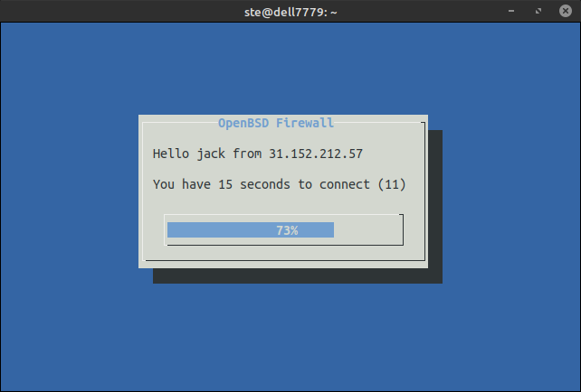

# Port Forward Opener on OpenBSD



> This setup allows external users to connect to internal servers through port forwarding.

Useful for:

- Small offices
- Cannot use VPN
- Don't like port knocking
- Accept connections to services with port fordward

Let's say a external user wants to connect to his internal desktop with RDP

1. The **User** makes a SSH connection to firewall.
2. The Firewall allows for a few seconds the IP of the user to connect to his internal desktop
3. The **User** makes a RDP connection to his internal desktop
3. The Firewall closes SSH connection automatically.

How it works

1. `fd.sh` Executed on SSH connection and sends objects like `{"jack", "10.20.30.40"}` to port 3000
2. `fw-server.sh` Listens to port 300 for objects and execute the `fw-allow.sh jack 10.20.30.40`
3. `fw-allow.sh` Add (for a few seconds only) the firewall rules to allow `10.20.30.40` further connections based on `/user/jack` file


**It's not ready for production. It's by far a non typical setup, and you must not use it if you don't know exactly what you are doing.**
## Addressing Scheme Example

```

                           [Desktop A] [Desktop B] [Desktop C]
                                |           |          |
[DSL]---[Firewall]---[Switch]---+-----+-----+-----+----+
                                      |           |
                                  [Server]     [Printer]


 Address        Node          Port Forward
 -------------  ------------  ------------------------
 192.168.1.1    DSL Router
 192.168.1.2    Firewall WAN    22 < 60022
 192.168.2.1    Firewall LAN

 192.168.2.11   Desktop A       22 < 60122, 3389 < 63381
 192.168.2.12   Desktop B       22 < 60222, 3389 < 63382
 192.168.2.13   Desktop C       22 < 60322, 3389 < 63383

 192.168.2.200  Server        3389 < 63389
 192.168.2.201  Printer

```

## Dependencies

```bash
pkg_add vim dialog # nothing works properly without vim
```

## Network Settings


:floppy_disk: `vi /etc/hostname.em0`

```bash
dhcp
```

:floppy_disk: `vi /etc/hostname.stge0`

```bash
media 100baseTX
mediaopt full-duplex
inet 192.168.2.1 0xffffff00
```

:floppy_disk: `vi /etc/mygate`

```bash
192.168.1.1
```

:floppy_disk: `vi /etc/resolv.conf`

```bash
nameserver 9.9.9.9
nameserver 1.1.1.1
```

## DHCP Server

:floppy_disk: `vi /etc/dhcpd.conf`

```bash
option  domain-name "taxstudio";
option  domain-name-servers 9.9.9.9;

subnet 192.168.2.0 netmask 255.255.255.0 {
    option routers 192.168.2.1;
    range 192.168.2.11 192.168.2.19;
}
```

:floppy_disk:  `vi /etc/dhcpd.interfaces`

```bash
stge0
```

Test server `dhcpd -d -c /etc/dhcpd.conf`

Start DHCP server at boot

```bash
rcctl set dhcpd flags stge0
rcctl enable dhcpd
rcctl start dhcpd
```

Show leases

```bash
cat /var/db/dhcpd.lease
```


## Firewall

Port forwarding

```bash
sysctl net.inet.ip.forwarding=1
echo 'net.inet.ip.forwarding=1' >> /etc/sysctl.conf
sysctl | grep ip.forwarding
```

Rules

:floppy_disk: `vi /etc/pf.conf`

```bash
wan = em0
lan = stge0

#----------------------------------
# Defaults
#----------------------------------
pass out keep state

set skip on lo
set block-policy return
set reassemble yes

block in all
block return

match in on $wan scrub (no-df max-mss 1440)
match out on $wan scrub (random-id)

antispoof quick for { $wan lo0 }

#----------------------------------
# Input
#----------------------------------
pass quick on $lan
pass in quick proto tcp to $wan port 22 keep state
pass in quick on $lan

#----------------------------------
# Output
#----------------------------------
pass out on $lan inet keep state

#----------------------------------
# NAT
#----------------------------------
match out on $wan from !($wan) nat-to ($wan)

# Allow outgoing traffic for LAN and the gateway
pass out quick keep state
pass in on { $lan } inet
```

Enable

```bash
pfctl -d
pfctl -f /etc/pf.conf
pfctl -e
```


## Setup Opener

Start at boot and listens the port 3000

```bash
echo "/firewall/fw-server.sh" >> /etc/rc.local
```

Add Users

1. Add user to system

```bash
# fw.sh will executed on user login
useradd -d /dev/null -s /firewall/fw.sh jack
passwd jack
```

2. Add user to opener

Add one or more pf rules to user file.

```bash
vi /firewall/user/jack
```
An example to allow user jack to make RDP connections to host 192.168.2.12:

`pass in proto tcp from IP to $wan port 63389 rdr-to 192.168.2.12 port 3388`

The `$wan` changes according to the address of the SSH connection that the user makes every time

## Todo

- chroot firewall users shell
- copy files in a more secure place
- email any activity
- convert `fw.sh` shell script to binary
